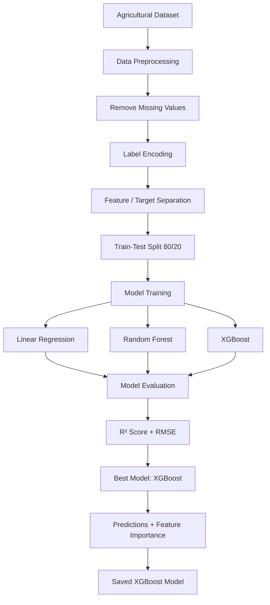

# 🌾 Prediction of Agriculture Crop Production in India

A Machine Learning project for predicting agricultural crop production in India using historical crop production data.

This project was developed as part of my **Industrial Internship** with **upskill Campus and The IoT Academy**, in collaboration with **UniConverge Technologies Pvt Ltd (UCT)**.

The project explores how machine learning regression algorithms can be used to analyze agricultural data and predict crop production based on factors such as **state, season, crop type, and cultivated area**.

---

## 📌 Project Overview

Agriculture plays an important role in India's economy, and accurate crop production prediction can help with better planning, resource allocation, food security, and decision-making.

This project explores a data-driven machine learning approach for predicting crop production from historical agricultural data.

The project follows an end-to-end Machine Learning workflow:

```text
Agricultural Dataset
        ↓
Data Cleaning
        ↓
Categorical Data Encoding
        ↓
Train-Test Split
        ↓
Model Training
        ↓
Model Evaluation
        ↓
Model Comparison
        ↓
Prediction Visualization
        ↓
Final XGBoost Model
```
🎯 Objectives

The main objectives of this project are:

Preprocess and analyze agricultural crop production data.
Convert categorical agricultural features into numerical representations.
Develop machine learning regression models for crop production prediction.
Compare different machine learning algorithms.
Tune the Random Forest model using GridSearchCV.
Evaluate model performance using R² Score and RMSE.
Visualize actual vs predicted crop production.
Analyze feature importance using XGBoost.
Save the trained XGBoost model for future use.
📊 Dataset

The project uses a CSV dataset named:

crop_production.csv

The dataset contains agricultural information used for predicting the target variable:

Production
Categorical Features

The following categorical features are processed using Label Encoding:

State_Name
Season
Crop

The project also uses numerical agricultural features available in the dataset, such as cultivated area.

Target Variable
Production

The machine learning models are trained to predict crop production based on the available input features.

Note: The crop_production.csv dataset is not included in this repository. It is required to execute Source.py and should be placed in the same directory as the Python file.

🤖 Machine Learning Models

Three regression approaches are implemented and evaluated.

1. Linear Regression

Linear Regression is used as a baseline regression model.

lr_model = LinearRegression()
lr_model.fit(X_train, y_train)

The model is evaluated using:

R² Score
RMSE
2. Random Forest Regressor

A Random Forest Regressor is used to capture more complex relationships in the agricultural data.

Hyperparameter tuning is performed using GridSearchCV.

Parameters explored include:

n_estimators:
100, 200

max_depth:
5, 10, None

min_samples_split:
2, 5

The model uses 3-fold cross-validation during hyperparameter search.

grid_rf = GridSearchCV(
    rf,
    param_grid=params,
    cv=3,
    n_jobs=-1,
    scoring="r2"
)
3. XGBoost Regressor

XGBoost is used as the advanced regression model.

The implementation uses:

n_estimators = 200
learning_rate = 0.1
max_depth = 6
objective = reg:squarederror
random_state = 42

XGBoost achieved the best performance among the tested models, with an approximate R² score of 0.92 as reported in the internship documentation.

🧹 Data Preprocessing

The following preprocessing steps are performed:

1. Load Dataset
data = pd.read_csv("crop_production.csv")
2. Remove Missing Values
data = data.dropna()
3. Encode Categorical Features
cat_cols = ["State_Name", "Season", "Crop"]

These categorical columns are converted into numerical representations using LabelEncoder.

4. Separate Features and Target
X = data.drop("Production", axis=1)
y = data["Production"]
5. Train-Test Split

The dataset is divided into:

80% → Training
20% → Testing

using:

train_test_split(
    X,
    y,
    test_size=0.2,
    random_state=42
)
📈 Model Evaluation

The models are evaluated using two primary metrics.

R² Score

R² Score measures how well the model explains the variation in crop production.

RMSE

Root Mean Squared Error measures the difference between actual and predicted production values.

The project compares:

Linear Regression
        ↓
Random Forest
        ↓
XGBoost

XGBoost achieved the highest performance among the tested models, with an approximate R² Score of 0.92.

📊 Visualizations

The project generates an Actual vs Predicted Crop Production plot using XGBoost.

Actual Production
        vs
Predicted Production

This visualization helps assess how closely the model's predictions match the actual production values.

The project also generates an XGBoost Feature Importance plot to understand the relative contribution of the input features to the model's predictions.

💾 Trained Model

After training, the final XGBoost model is saved locally using Joblib:

joblib.dump(
    xgb_model,
    "final_crop_prediction_model.pkl"
)

This generates:

final_crop_prediction_model.pkl

The generated .pkl model file is not included in this repository.

It can be used as a starting point for future deployment or integration into an application.

🛠️ Technologies Used
Programming Language
Python
Libraries
Pandas
NumPy
Matplotlib
Seaborn
Scikit-learn
XGBoost
Joblib
Machine Learning
Linear Regression
Random Forest Regression
XGBoost Regression
GridSearchCV
Train-Test Split
Label Encoding
R² Score
RMSE
📁 Repository Structure
upskillcampus/
│
├── Source.py
├── Chiranjeev_InternshipReport_USC_UCT.docx
└── README.md
File Description
File	Description
Source.py	Python implementation of the crop production prediction project
Chiranjeev_InternshipReport_USC_UCT.docx	Detailed internship project report
README.md	Project documentation and setup instructions
⚙️ Installation
1. Clone the Repository
git clone https://github.com/chiwwwra/upskillcampus.git

Navigate to the repository:

cd upskillcampus
2. Install Required Libraries

Install the required Python packages:

pip install pandas numpy matplotlib seaborn scikit-learn xgboost joblib
▶️ Running the Project

Before running the project, make sure you have the required dataset:

crop_production.csv

Place it in the same directory as:

Source.py

Then run:

python Source.py

The program will:

Load the agricultural dataset.
Remove missing values.
Encode categorical variables.
Split the dataset into training and testing sets.
Train Linear Regression.
Tune and train Random Forest.
Train XGBoost.
Calculate model performance.
Display the Actual vs Predicted visualization.
Display XGBoost feature importance.
Save the final XGBoost model locally.


## 🔬 Project Workflow


🏆 Results

The project evaluated multiple regression algorithms and found that XGBoost performed best among the tested models.

The internship documentation reports an approximate:

XGBoost R² Score ≈ 0.92

The model demonstrated its ability to capture non-linear relationships within the agricultural data.

The project also uses:

Actual vs Predicted visualization
XGBoost Feature Importance

to provide additional insight into model performance.

💡 Applications

This project can serve as a foundation for applications such as:

Agricultural production planning
Crop production estimation
State-wise agricultural analysis
Resource allocation
Supply-chain planning
Agricultural decision support
Policy-making and planning
🎓 Internship Context

This project was developed as part of an Industrial Internship provided by:

upskill Campus + The IoT Academy

in collaboration with:

UniConverge Technologies Pvt Ltd (UCT)

The internship involved working on a project/problem statement provided by UCT.

The project focused on developing an end-to-end machine learning solution for agricultural crop production prediction.

The implementation involved:

Data acquisition and EDA
Solution design
Model implementation
Training and evaluation
Hyperparameter tuning
Cross-validation
Visualization
Performance comparison
📚 Learning Outcomes

Through this project, I gained practical experience in:

Data preprocessing
Feature engineering
Machine learning regression
Model training
Hyperparameter tuning
Cross-validation
Model evaluation
Data visualization
Feature importance analysis
Saving trained ML models
End-to-end machine learning workflow
🚀 Future Improvements

Possible future improvements include:

Deploying the model using Flask or Streamlit
Integrating real-time weather data through APIs
Exploring deep learning approaches such as LSTMs for time-series forecasting
Using larger agricultural datasets
Extending the project to additional countries
Building a user-friendly interface for farmers and other users
📖 References

The project documentation references:

Government of India, Ministry of Agriculture and Farmers' Welfare Data Portal
Scikit-learn Documentation
XGBoost Documentation
Kaggle agricultural datasets and notebooks
👨‍💻 Author
Chiranjeev Kumar

B.Tech Student | Machine Learning & Software Development Enthusiast

GitHub: @chiwwwra

⭐ Acknowledgement

This project was completed as part of my Industrial Internship with upskill Campus and The IoT Academy, in collaboration with UniConverge Technologies Pvt Ltd (UCT).

The internship provided an opportunity to work on a practical machine learning problem and gain hands-on experience in developing an end-to-end ML solution.

⭐ If you find this project useful, feel free to explore the repository and learn from the implementation.
